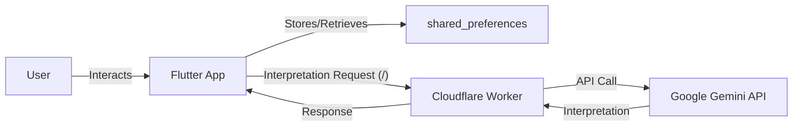

# System Patterns

## 1. System Architecture

*   **Client:** Flutter application (Mobile/Desktop).
*   **Backend Logic (Interpretation):** Cloudflare Worker acting as a proxy/middleware.
*   **AI Service:** Google Gemini API (`gemini-pro`).
*   **Data Storage:** Local device storage (`shared_preferences`) via Flutter app.

## 2. Key Technical Decisions

*   **Flutter:** Chosen for cross-platform development (mobile/desktop).
*   **Cloudflare Worker:** Used as a lightweight backend to handle Gemini API calls securely and apply specific prompting.
*   **`shared_preferences`:** Selected for simple local persistence of dream data within the Flutter app.
*   **Provider:** Standard choice for state management in the Flutter community.

## 3. Design Patterns

*   **State Management:** Provider (Dependency Injection, Change Notification).
*   **Asynchronous Programming:** Futures, `async/await`, `FutureBuilder`.
*   **Service Layer:** Separation of concerns with `ServicoApiCloudflare` handling local storage and API calls.
*   **Model-View:** Separation between data (`Sonho` model) and UI (`TelaListaSonhos`, `TelaEntradaSonho`, etc.) - likely follows MVVM or a similar pattern facilitated by Provider.
*   **Proxy:** Cloudflare worker acts as a proxy to the Gemini API.

## 4. Component Relationships

*   `main.dart` initializes the app and runs `DreamJournalApp`.
*   `DreamJournalApp` sets up `MaterialApp`, theme (`AppTema`), and provides `ServicoApiCloudflare`.
*   `TelaListaSonhos` (initial screen) uses `ServicoApiCloudflare` to fetch dreams from `shared_preferences` and displays them using `CartaoSonho`.
*   `TelaEntradaSonho` uses `ServicoApiCloudflare` to save dreams to `shared_preferences` and request interpretations from the Cloudflare Worker.
*   `TelaDetalhesSonho` displays data loaded from a `Sonho` object (originating from `shared_preferences`) and allows deletion via `ServicoApiCloudflare`.
*   `ServicoApiCloudflare` interacts only with `shared_preferences` for CRUD and the Cloudflare Worker (`/` endpoint) for interpretation.
*   `CloudflareWorker` interacts only with Gemini API for interpretation.

## 5. Critical Implementation Paths

*   **Dream Creation/Saving:** `TelaEntradaSonho` -> `ServicoApiCloudflare.salvarSonho` -> `shared_preferences`.
*   **Dream Interpretation:** `TelaEntradaSonho` -> `ServicoApiCloudflare.obterInterpretacao` -> Cloudflare Worker (`/`) -> Gemini API.
*   **Dream Loading/Display:** `TelaListaSonhos` -> `ServicoApiCloudflare.obterSonhos` -> `shared_preferences`.
*   **Dream Deletion:** `TelaDetalhesSonho` -> `ServicoApiCloudflare.excluirSonho` -> `shared_preferences`. 